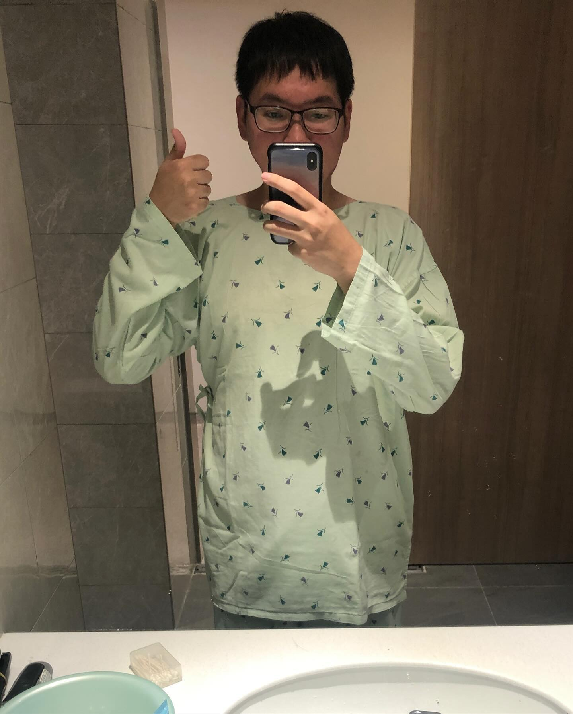
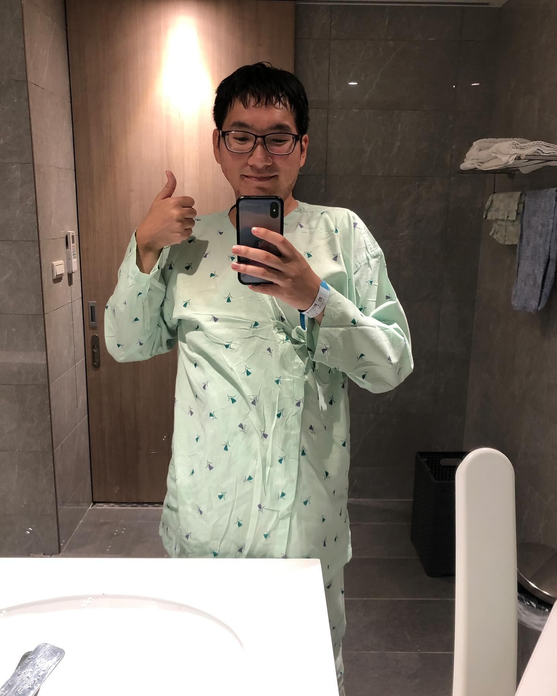

2023年的國慶連假在醫院度過，年初就已經排好住院的日期，這是第三次的開刀，部位是兩邊的肩膀。

不太會有人會曉得，**我的肩膀一直受到蠻大的張力拉扯，對生活的影響頗大，包括失眠、駝背、筋膜沾黏等，疤痕的張力日夜無法擺脫，導致我習慣性聳肩，也較難好好放鬆**。

這次住院帶的書是《障礙政治》、《談病說痛》以及禾子的實習總報告，**雖然因為太過難受根本沒有足夠的狀態可以閱讀，但即便只是翻了幾頁我仍覺得非常有意義**。

---
剛動完手術的幾個夜晚，**挺讓人難熬的，身體正在適應新的張力，一方面切除疤痕讓張力變小，但手術縫合也因此讓身體更拉緊，肩膀的皮膚不斷被撕扯拉開的感覺**。

仔細梳理所感受到的**疼痛至少有三種：手術縫合傷口的痛、身體張力拉扯的痛、原本的疤痕拉扯的痛**。**疼痛的交互作用又產生更多更複雜難受的疼痛**，如此經歷了幾個難過的夜晚。

**難受的時候，自然而然就會想著自己的生命、自己的存在、擁有的關係、重要的他人，拼了命地擠出意義感來延續生存意志力**。

>「**慢性疼痛也是慢性死亡的過程，無論是否有疼痛，我們都是向死而生地存在著**。」我心想。

---
這次住院與前兩次不同，我想最大的差別在於自己的狀態並沒有完全掉下去，**以往會感到自己很虛弱、被病理化、呈現很廢很被動的狀態，甚至自暴自棄（？），在絕望中找到一點希望的感覺**。但這次不同的是**感受到自己是被陪伴的、自己的存在是被肯認的**。

我想這樣的變化就來自關係上的轉變，**禾子給了我很大的支持和動力，讓我更能與自己相處，正視自己的模樣，雖然仍在練習中，但相信已經進步了好多**。

---
住院期間，透過復健的過程，我也**對於「被幫助」這件事深深有感**。

**從無法自己下床、吃飯，漸漸復健到可以自己下床，每天都發現自己的身體越來越進步**。

我仔細地覺察自己的能力限制到哪裡：

>「哪些是我目前尚未無法做到的？哪些是我目前有能力做到的，只是需要花費多一點時間？」

事實上這些事情在不斷嘗試中都是清楚的。

呼應《障礙政治》提到障礙者的自立生活，我認為**不只是助人者要建立「幫助的界線」，障礙者當事人也要建立界線**。

**即便「我需要幫助」是一個客觀的事實，但更重要的是，我可以決定自己要怎麼被幫助、要不要被幫助**，**每一次都做出決定，這是身為當事人的自尊也是主體性的重要來源。因此，依然回到「為自己做決定即是成為自己」這件事**。

---

總而言之，手術算是挺順利的，目前也已經拆線，漸漸回到正常生活的軌道上（不可以再耍廢）。

儘管這樣的手術是一種不得不的辦法，**畢竟無法完全切除所有的疤痕（醫生說我正常的皮膚太少了），但至少改善身體的張力，讓身體再繼續活個幾十年吧**。

**特別想感謝禾子的陪伴，並且不斷告訴我疤痕的正向意義、告訴我我的身體是美麗的，於我來說具有非常龐大的意義，覺得自己的存在被肯定了**；某種程度上，這也呼應障礙認同的精神，讓障礙不只停留在負面的意涵。

**帶著這具身體、帶著與禾子的關係，我覺得自己擁有很多，因此感到幸福，也充滿希望**。目前正朝著寫論文的方向，**期望透過自身的生命經驗寫出一篇慢性疼痛的論文**。

無論他們怎麼說「這跟社會工作有什麼關係？」**我覺得最本質上「受苦」對應到就是要被「理解」，疼痛對應到要被「照顧」。慢性疼痛者的世界長期累積令人失語的苦，助人工作者的使命不就是要貼近當事人的世界嗎？當然是有關聯的**！

**就如同疼痛有時不一定有什麼偉大的意義，也不會有某個「開口」或方向性**，我想我的論文也會是如此：

>**存在的本身即是意義；書寫的本身即是意義，這是於我身上貫徹始終的**。

