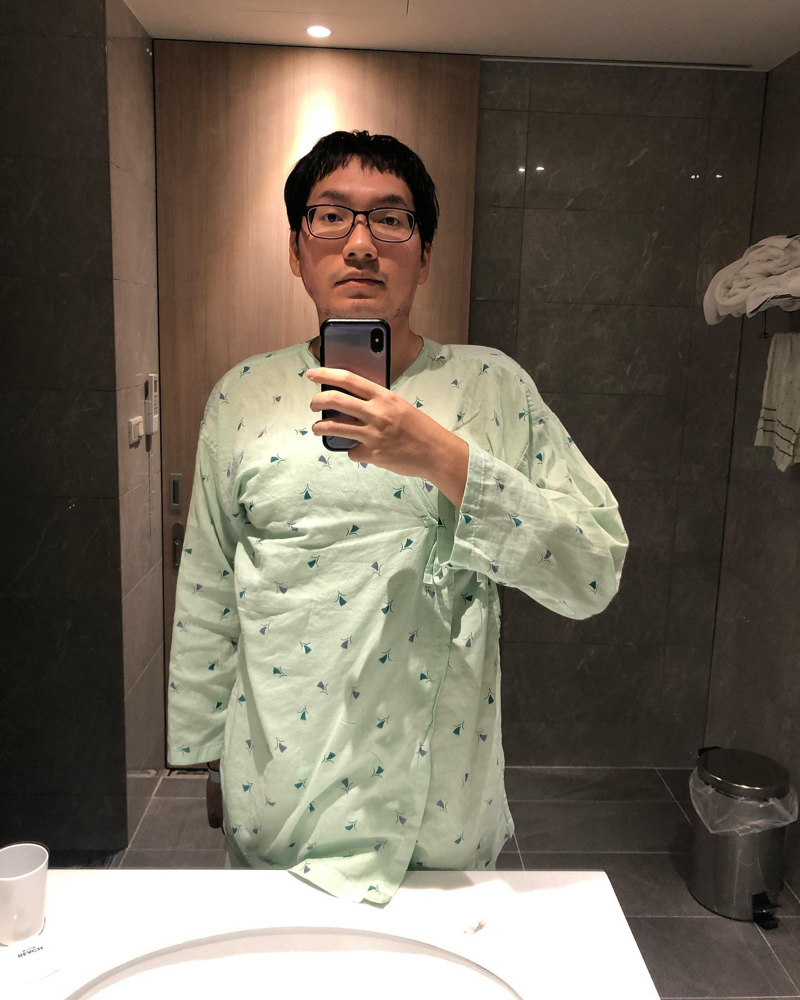

>「**哀悼、沈默、蜷曲、適應。被遺忘的，就留守原地**。」—〈兩個選擇〉

前幾天在醫院進行了第二次的手術，**切除了胸前一大部分蟹足腫疤痕，留下三十公分的縫線**。

幸運的是，一切並沒有想像中那麼疼痛，現已恢復原有的日常。醫生說我可能天賦異稟，護理師則說都可以滑筆電了應該沒那麼嚴重吧XD

>全身麻醉的時候，像是死亡，失去了意識。甦醒的時候，我不忘提醒自己保持呼吸，畢竟呼吸是少數我們能稍微控制的自主或半自主行為。

住院的時候，原本還想說可以多看書或畫畫，但體力實在有限，後來就用阿勇的Giloo優惠碼好好看完「**你我的解放相同**」片單，很合適也很滿足。

---

才剛結束手術的幾天，我就知道手術是正確無比的事，切除胸前大面積的疤痕，釋放了十幾年來身體的張力。

在一邊適應新的身體狀態時，**我才意識到自己一直以來承受著如此巨大的張力，即便努力放鬆身體，疤痕仍然拉扯著全身**。

**疼痛之外，身上的疤痕還會卡著髒污，甚至發出異味**。失眠是長期以來的日常，原來是因為當我躺平時，**胸前疤痕就會產生張力、發炎、刺激，讓整個身體都難以放鬆休息，我也因此需要各種方式強迫自己睡著**。

---
慢性疼痛的日常，在這幾天就已感受到好轉，睡眠品質提升，**受到疼痛干擾的狀況減輕，原本需要一直轉移注意力來減痛的狀況也好了一點**。雖然仍有許多疤痕尚待處理，疼痛也沒有完全消失，但，**帶著感謝的心自己存活到了此刻**。

>「啊～原來我一直承受這麼大的張力在生活啊。原來減輕張力的身體感覺起來是這樣子。」

我極少告訴別人自己的日常充滿著多少痛楚，24小時，365天，因為那並不太能改善我的現況。

**那些不為人知的疼痛，在鼓起勇氣接受手術後得到釋放。我現在更能好好的呼吸，更能好好做自己想做的事，好好活著**。痛苦的眼淚轉變成了感動的眼淚。

---

作為一個慢性疼痛的人，**其實疼痛教會了我許多事情。部落格名為「聆聽疼痛」，正是期望自己好好聆聽身體而來的疼痛，與之共處，同時也聆聽他人的受苦**。

我知道，**對一般人來說再簡單、正常不過的事，對某些受苦者來說卻是一種奢求、無法觸及的幻想；受苦者額外承受了一般人不需要、不曾想過的苦**。

我其實覺得，**那不一定代表受苦者就注定要被詮釋為可憐，或有某種優劣之分，但那就是真實存在且需要被見證的—「受苦者的存在空間」**。

---
經過幾天的沉澱，我知道自己是幸運的，也因此充滿感謝。感謝醫生的技術，感謝家人的經濟條件允許，這次甚至住了超高級病房。**感謝所有曾經為我祈禱祝福過的人們，那些不可見的關心和期望都是真實無比的**。

最後，**感謝自己每次想放棄時都沒有真的放棄**，拼命想著「我都已經撐到現在了，怎麼能輕易放棄」。

感謝自己的身體承擔著張力和疼痛終究活了下來。**儘管疼痛尚未完全消失，但至少減少了苦楚，拉近與這個世界的距離**，**期許自己不再那麼畏縮、自卑、蜷曲地存在於世，期許自己有一天能夠張開雙臂擁抱自己、愛自己**。

畢竟，我始終是個熱愛世界的人。

---
### 搭配服用

[K.I - 獻給我自己](https://youtu.be/7ZVaN7Edxw0?si=9kfcF3csCFJlf6pH)