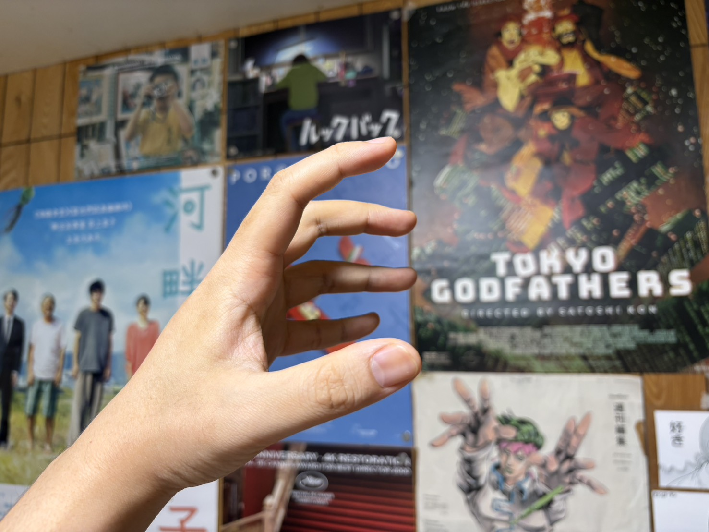
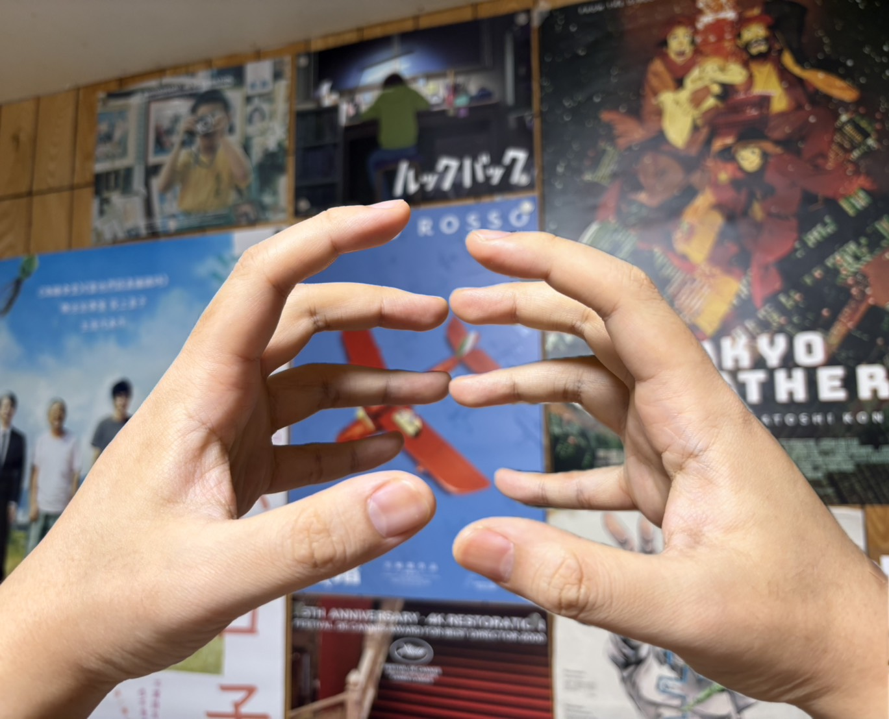
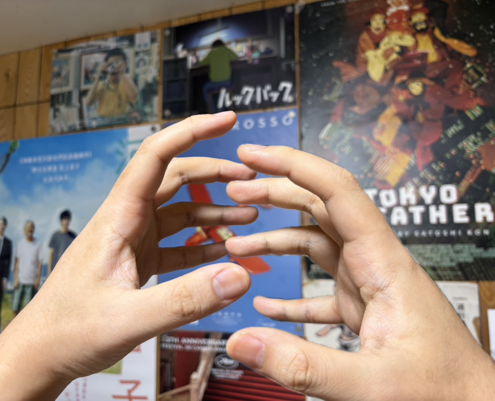
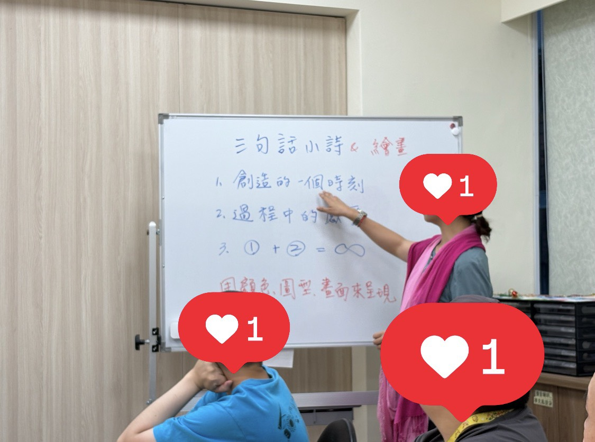

今天上課畫的作品，是我對正念意義的詮釋：

>從自己手的線條開始，手中可掌握的是此時此刻，無法掌握的是彼時彼刻，而我在穿越其中

>指尖的縫隙並非缺失，而是互補的空間，如同觸碰水一樣，手與水並非主體/背景關係，而是互為主體的流動

>指尖流過的水宛如溪谷，是藍色的。
---
### 解釋

這個作品來自4/23舞蹈治療課程，Natasha帶進了《**社會流線劇場**》的內容，從**個人身、社會身、地球身**，三個層次。

在第一階段個人身到社會身，意味著一種從自己到與他人建立關係。大家要能夠有自己的身體節奏表達，到了社會身能否用默契或其他方式，去感知她人，能夠有「一起」的感覺。

>OS：「相對於口語文字，身體的表達沒有標準答案，而且是代表自我的、貼近自我的，不像是語言隔了一層媒介」

在這個「從個人身到社會身」的階段，我腦中就浮現一個意象來理解這過程。這意象是我的左手與右手，他們張開手指彼此靠近時，指尖碰到指尖，是無法結合，是會碰在一起的，然而，只要角度稍微變換，兩隻手可以在指縫間嵌合，形成十指交扣。

在此，左手與右手都是個人身，十指交扣則是社會身。

透過這個意象，我想去說明，個人身仍然可以維持個人身，自己仍然可以做自己，在直觀的結合下會碰撞、行不通，但是稍微調整角度之後，個人身就可以建立關係，形成社會身，他仍然是他自己，本質上不用改變。（票亮提醒，不是說都不用改變，而是在本質上）

---
### 地球身

延續這個意象，第二階段的地球身，Natasha帶我們進行了一段類似冥想的過程，在引導語下去想像自己站在地球上、自己肉身與地球的連結等。

冥想結束後，開始進行句小詩的創作，寫詩或是用繪畫表達都行

---
### 沉澱之後

此時我沈澱後的內心浮現的是，想要先用我的手直接在紙上描出線條，這是用我的手描出的線條，線條裡蘊含了我的意義，最能代表我的線條。

接著，我立刻想到的是，**在手中可掌握的是此時此刻，相對於此，手線條以外的部分是彼時彼刻，是我無法掌握的**。

在此時此刻與彼此彼刻之間，這兩個看似相反衝突的概念，**靠著穿越可以看見兩者在本質上是相同的，空不異色、色不異空**。

>補充：我如何體悟穿越這詞，是在搭公車上、在走過橋上的歷程，覺察到空間的變化，**前進的發生勢必要空間的後退，兩者相應而生，本質上是相同的**。

>後記：前進與後退同時發生，直接表明了「**道生一，一生二，二生三，三生萬物**」。**作用力與反作用力同時發生，相對而非對立，陰影也是如此**。

穿越的線條是紫色的，**紫色是唯一一種同時具備冷色與暖色特質的顏色，藍色加上紅色。他是一種中介，是一種融合，是一種穿越**。

---
### 指間/指縫的意義

指間/指縫，我寫了間隙、空白、互補。延續第一階段手的意象，他們在不同角度下可以從碰撞轉為十指交扣的融合，這意味著這些凹陷與空白，並非一種缺陷，他可以是互補的空間，他具有凹下去的意義，並非缺陷。

此處可以延伸到跟小宇學素描時，有所謂「負形」的概念，在圖中並不會限制自己把手視為主體、背景視為背景，這兩者的關係是可以被挑戰的，因為他們也是相應而生的。指間可以被看做凹下去的部分，但也可以反過來看成是島嶼的峽角。

（主體與背景，這個典範可以被挑戰，更理想的關係是互為主體，是流動的）

因此，這說明了指間的空白的意義，他可以作為互補的空間，負形的觀點下是有意義的。

這些意義的出現，更是讓我連結到一個游泳的經驗，當我用手把水滑開的時候，我感受到水充滿了我的指間，這同樣是相應而生的，相對的。連結到穿越的概念，蛙式也是一個在水裡空間中穿越往前的經驗哦。

連結到水的意象，指間V字的形狀讓我聯想到溪谷，既然水充滿了指間，那如同河流、下切的溪谷一樣不斷往下，才形成V字。

既然有溪谷了，那指頭頂端就會是一些樹木吧，因此用綠色

小拇指，在最邊緣的位置，在這個位置，我用黑色，光還照不到的地方，還有些沒辦法處理的部分。而我想到的句子，曾讀過的詩句，提醒告訴自己「被遺忘的，就留在原地。」

正念的意義在我的手中，穿越、此時此刻、彼時彼刻、素描的負形、互為主體、空白並非缺陷而是互補空間，有其意義，這些都幫助我去穿越

色不異空，空不異色，色即是空，空即是色。

空白的實在感

好想學太極或氣功

---

## 4/25跟票亮、海獺、冰豬聊聊之後又更有感覺

開放式對話，互為主體，工作是讓人成為自己、如逃避自由所說的

感覺靈魂有受到滋養，

票亮說我之前都透過4D邏輯的層次去理解，這樣會累會吵

在5D就可以相通、理解，有自己的理解

4D可能會打架

我有說畢業後閱讀的動力改變，不再一直要獲得知識，

我的優點大概是，很多東西很快可以連結起來，可以看見本質上是相通的，這些概念可以整合，

票亮說我很聰明，大概靈魂都學過
所以現在就可以在這個層次上
5D就可以通
平行時空跨越
每個人的4D在討論中會有交會點，形成那個接近本來面目的點
照鏡子？投影？