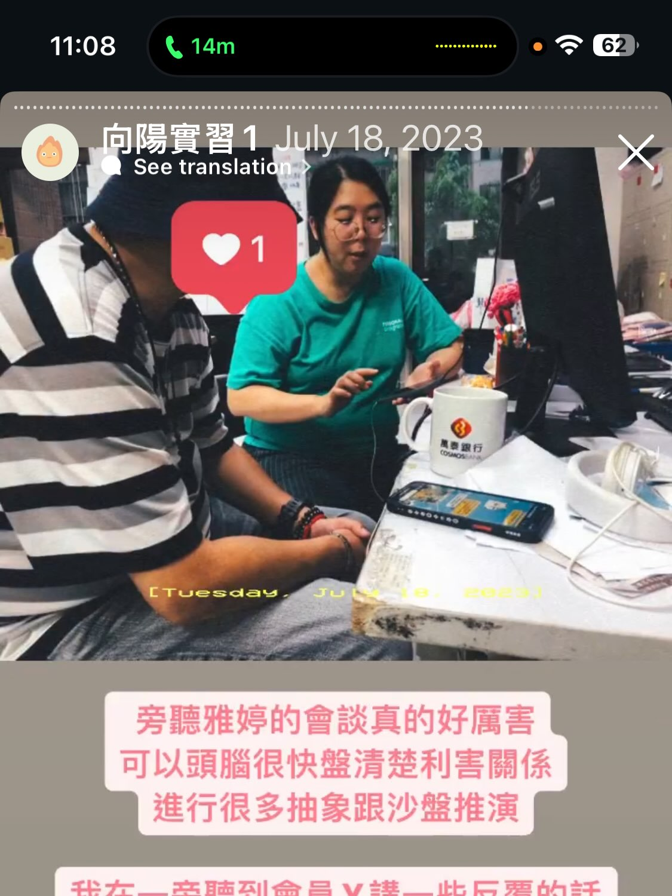

今天團督檢討偷竊事件的處理，我很誠實地說，沒想到那麼信任的會員會偷竊，覺得很生氣受傷，所以一直威脅要報警。其實我本來就打算往很嚴重的方向處理，因為真的好過分，忍不住就覺得好生氣，氣不過。可是今天被提醒「**沉住氣**」的重要性

---

雅婷提醒說，

1. 遇到事情要先盡快形成團隊共識、確定下一步之後，再出手行動，不然我前面忍不住放話要報警，就沒什麼效果，對方會覺得又不會真的報警，只是說說而已。要先確定好真的下一步可以報警。

2. 偷竊事件多罰幾倍錢會有爭議，家屬可能不同意這做法，超出原本賠償金額，只能在合理範圍內先讓他負起責任，關係上則還有其他討論空間。

3. 忍不住怎麼辦？就真的很生氣啊，偷東西怎麼可以賠償原本的飲料錢就好，賠完錢又一副沒事的樣子，很自以為是，看了就氣。

---
#### 忍不住怎麼辦

面對信任的會員偷竊，我覺得好生氣又好失望，看到對方充滿僥倖，覺得又沒什麼大不了的樣子，我總是忍不住會覺得很生氣。我問雅婷忍不住、氣不過怎麼辦，雅婷就舉自己被會員投訴的例子回應。

重點是，我完全記得那個會員Y的事情，因為當時就是雅婷邀請我一起旁聽會談，沒想到後來雅婷就被投訴了，因為講了一句輕浮的話。

---
#### 職員擁有更多條件，要學會沉住氣

雅婷用自己舉例，她也有忍不住、氣不過的時候，我覺得就有被回應到。

而且她說，

> **沒辦法忍不住，除非會員跟你一樣也有穩定工作、有薪水、有這些生活條件。這點出會員始終有他的社會地位和生命脈絡**。

聽到這裡，我其實釋懷很多。但下班路上還在想著，**難道就沒辦法靠真誠建立平等的關係嗎？始終會有彼此的不同**？

**這次我的受傷在於，原本給了很多信任，現在收回來，發現會員跟自己想的不一樣**，他有那些低水準的習性，即便對他很好，還是會偷竊。雅婷說可以再觀察兩年左右吧。

---
#### 現實面上的階級文化差異?

我覺得今天的收穫是另一個里程碑，當我拿出真誠跟會員建立關係互動、不斷強調我們彼此的相同之處時，創造了信任關係。

**可是走到某一天，發現會員始終有他的習性、他的家庭、文化、階級**等，你會知道彼此仍然有不同的地方，仍然很不一樣。**我想我是一時很難接受那個不一樣，忽然因為那個反差而感到受傷**。

關係的課題，從一開始的相遇。強調相同、建立信任，到後來發現始終不同，彼此仍然有各自的模樣，的現實面。

某種程度來說也是放手，或是**反思到我太自私覺得會員就該是某種樣子，畢竟我都對他那麼信任、那麼好了。那種難以接受，真的是關係的課題**。

---
#### 想到無恥之徒Shameless

回家後還是會看《無恥之徒Shameless》的片段，**關於貧窮、精神疾病、Survive、Struggle的生活，這些迫於現實的骯髒、下流、無恥，還有Gallagher一家的敘事，正是人們迫於現實的生活方式**。

---
#### 懷念實習期間的學習

回家翻出實習期間的限時動態好懷念，到現在還能跟雅婷團督討論，一起動腦的狀態，覺得好充實！

