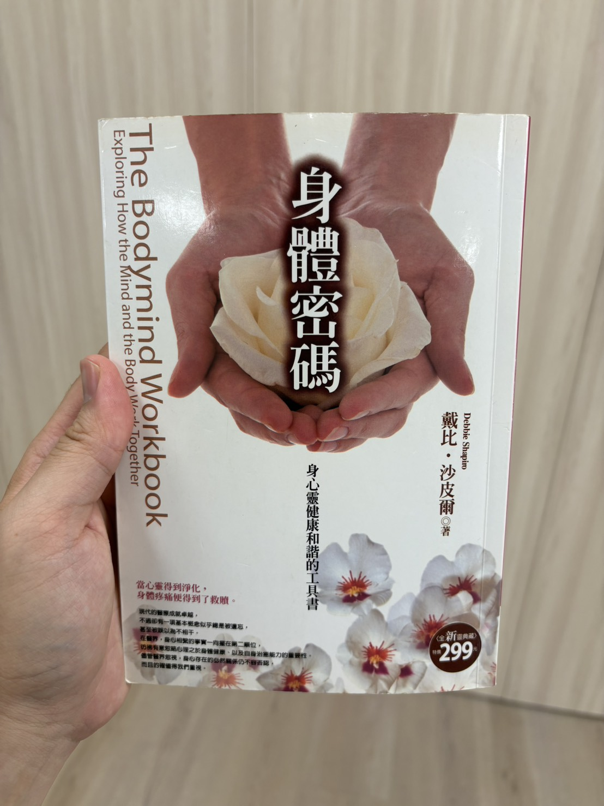

這兩次舞蹈治療都跟Natasha一起討論會員的動作分析，覺得收穫良多。
⁡
原來從一個人走路的姿勢、施力的方式、重心的轉移都可以反映身心狀態，光是從腳就可以發現很多線索，從腳開始影響全身的姿勢。
⁡

例如：今天觀察到會員S不太能用力踩地，明明要踏地板卻變成抬腳，反而很多力量是內收的，力量沒辦法順利傳導到肢體把力量施放出去。

⁡
這間接影響他走路的動作，因為走路需要有前後腳配合，後腳要踩地把身體往前推。會員S的走路型態更像躡手躡腳，踩地是沒有力氣的，而且經常聳肩、肩頸僵硬。**這反映了他的生命狀態中，經常害怕犯錯的特徵，加上手足長期對他的批判讓他更容易焦慮，手也會握拳，進入一種緊張的身體姿態**。
⁡
⁡
藉由動作的觀察與分析，從不同面向更認識會員，身體反映心理是很真實的，且相互影響的。我認為這也是一種代償。

---
⁡
上次正好聊到此話題，在助人工作領域真的很需要身體經驗方面的專業。**我們針對心理狀態和情緒的工作很多，卻往往容易忽略身體的重要性**。

**心理上的壓力或焦慮，身體也會用某種方式代償，但這需要結合身體和心理兩種專業才能回應**。⁡

不曉得有沒有結合心理師和健身教練的專業呢？還有舞療師？身體與心理專業呈現各自分開的現況，不曉得從什麼時候開始的，但我覺得非常有必要將兩者結合，他們同等重要。

---
⁡

助人工作遠比想像中有更多層面，並非社工或心理工作就足夠。我所工作的地方，結合了不同的資源，現在有舞蹈治療和塔羅諮詢，正好能回應身體和靈性的層面。
⁡
套一句票亮昨天說的，我們都是能量體，會留下「**能量的痕跡**」。
⁡
身心狀態亦是如此，**身體狀態是心理留下的痕跡，心理狀態是身體留下的痕跡，兩者是緊密一體的，彼此互相影響，甚至存在代償的關係。身心應該一起被檢視**。
⁡
《肌力就是你的療癒力》有空來看
⁡
⁡（舞療跟健身觀點又不太一樣，好有趣）
